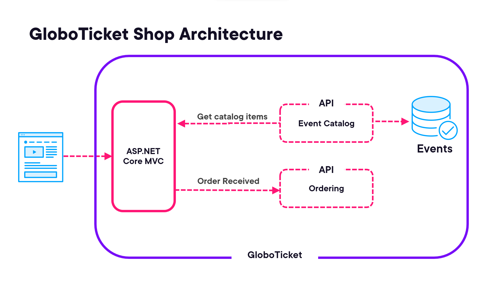

# KubTechChallange Demo Application

Aplicação de entrega do Tech Challange fase 5 - FIAP - Arquitetura de Sistemas .NET com Azure

## O Problema
O Tech Challange desta fase será a publicação do seu projeto em um cluster Kubernetes.

A proposta deste Tech Challenge é elaborar um arquivo Dockerfile para o seu projeto e realizar sua publicação dentro de um cluster Kubernetes. Este projeto não precisa ser publicado no AKS, pode ser um cluster local. 

## Globoticket Architecture
Globoticket uses two additional web api projects that provide an APIfor getting the 
catalog data and for registering the order when the order is completed.
this is shown in this architectural diagram below:

## Kubernetes deploymens
The course will take a step by step apporach to deploy this application first using containers
on the localhost using docker-compose.
Next the application will be deployed to a local kubernetes cluster running ont he development machine
Then we wil deploy it to a cluster running in Azure, using AKS
Finaly we will optimize the application for use in a kubernetes cluster.
for this we will improve the obeservability, use of environment variables and manage secrets in a better way.
the final step is we will deploy each individual service using CI/CD automation with GitHub Actions or Azure DevOps pipelines.

