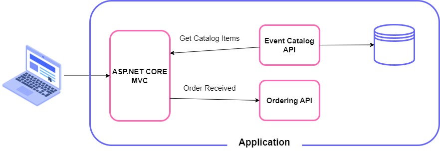
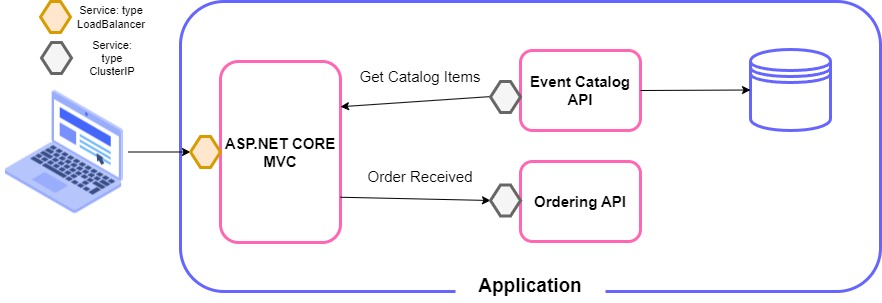

# KubTechChallange Demo Application

Aplicação de entrega do Tech Challange fase 5 - FIAP - Arquitetura de Sistemas .NET com Azure

## O Problema
O Tech Challange desta fase será a publicação do seu projeto em um cluster Kubernetes.

A proposta deste Tech Challenge é elaborar um arquivo Dockerfile para o seu projeto e realizar sua publicação dentro de um cluster Kubernetes. Este projeto não precisa ser publicado no AKS, pode ser um cluster local. 

## Vídeo do Youtube
https://youtu.be/sxysscvQukE

## KubTechChallange Architecture

## KubTechChallange Kubernetes Architecture

